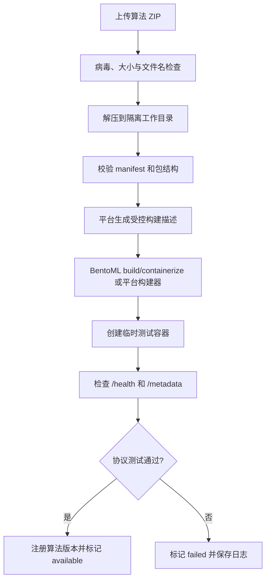
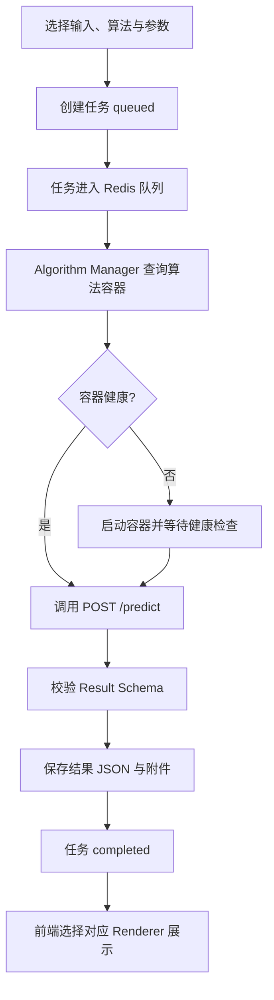
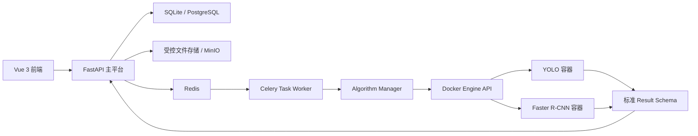

# 多算法 CV 可视化平台 PRD

> 文档版本：V1.0  
> 文档日期：2026-08-12  
> 产品阶段：MVP 实现稿（本地无数据库模式）  
> 当前原型：Faster R-CNN 训练推理平台

> 实现说明：当前本地开发按项目决策不创建数据库，使用内存仓储与受控文件存储。详细完成情况见 `FEATURE-COVERAGE.md`，服务器持久化阶段再引入 PostgreSQL、MinIO 和 Redis/Celery。

## 1. 产品概述

### 1.1 产品名称

多算法计算机视觉可视化平台（暂定名：CV Algorithm Studio）。

### 1.2 产品定位

面向算法开发者、研究人员和教学用户，提供一个可在本地 GPU 服务器部署的计算机视觉算法托管、运行、比较与结果可视化平台。

平台采用“一种算法/一个版本对应一个独立容器”的运行模式。不同算法可以使用不同的 Python、PyTorch、CUDA、PaddlePaddle 或 OpenCV 版本，主平台通过统一协议调用算法容器，并将目标检测、分类、分割、OCR、姿态估计等结果转换为统一的前端可视化体验。

### 1.3 核心价值

- 降低不同 CV 算法的环境配置和部署成本。
- 避免多个算法共用 Python 环境时产生依赖冲突。
- 通过统一输入、输出和任务协议屏蔽算法实现差异。
- 支持同一输入在多个算法间运行和结果对比。
- 将现有 Faster R-CNN 单算法工具升级为可扩展的平台。

### 1.4 产品边界

平台负责：

- 算法包上传、校验、构建、注册和版本管理。
- 算法容器启动、健康检查、调用、停止和资源限制。
- 图片上传、任务排队、状态跟踪、结果存储与下载。
- 检测框、分类概率、掩码、文本区域、关键点等统一可视化。
- 算法运行日志、错误信息和基础资源状态展示。

平台不负责：

- 第一版不提供 Kubernetes、多节点集群和自动扩缩容。
- 第一版不允许普通用户上传任意 Dockerfile。
- 第一版不构建完整的数据标注协作平台。
- 第一版不支持大规模分布式训练。
- 第一版不承诺兼容任意未经适配的 Python 项目。

## 2. 背景与现状

当前项目已经具备 Faster R-CNN 的项目管理、图片上传、标注、训练、推理和结果展示能力，但算法代码、训练逻辑和平台服务运行在同一个应用镜像内，存在以下限制：

- 只能围绕 Faster R-CNN 扩展，新增算法需要修改主后端。
- 所有算法必须共享 PyTorch、CUDA 和 Python 依赖。
- 算法故障可能影响主平台稳定性。
- 推理结果协议与 Faster R-CNN 实现耦合。
- 算法无法独立升级、回滚、启停或限制资源。

本项目需要将现有结构逐步拆分为“平台服务”和“算法容器”两层，并将 Faster R-CNN 改造成第一个标准算法插件。

## 3. 用户与使用场景

### 3.1 用户角色

| 角色 | 主要诉求 | MVP 权限 |
|---|---|---|
| 平台管理员 | 管理算法、构建镜像、查看日志、控制容器 | 全部权限 |
| 算法开发者 | 上传算法包、发布版本、调试推理 | 算法与任务权限 |
| 普通使用者 | 上传图片、选择算法、配置参数、查看结果 | 推理与结果权限 |

MVP 可以先使用管理员单账号模式，但数据模型和接口应保留 `owner_id`、`created_by` 等扩展字段。

### 3.2 核心使用场景

#### 场景 A：导入算法

算法开发者上传符合平台规范的 ZIP 包。平台校验清单文件和目录结构，生成或调用标准构建流程，构建算法镜像，启动测试容器并检查 `/health` 与 `/metadata`。测试通过后，算法版本进入“可用”状态。

#### 场景 B：单算法推理

用户上传图片，选择算法版本并调整置信度等参数。平台创建异步任务，确认算法容器可用，调用 `/predict`，保存标准结果，前端根据结果类型完成渲染。

#### 场景 C：多算法对比

用户选择同一张图片和多个兼容算法。平台分别创建子任务，并在完成后以并排视图、叠加视图和指标表展示结果差异。

#### 场景 D：释放 GPU 资源

算法容器超过设定时间无人使用后，平台自动停止容器。用户再次调用时，平台重新启动并等待健康检查通过。

#### 场景 E：算法故障诊断

算法构建或推理失败后，开发者可查看结构化错误、容器日志、构建阶段和失败时间，并重新构建新版本。

## 4. 产品目标与成功指标

### 4.1 MVP 目标

1. 将 Faster R-CNN 从主平台拆分为独立算法容器。
2. 接入第二个目标检测算法（建议 YOLO）并验证环境隔离。
3. 支持图片上传、异步推理、状态跟踪和检测框展示。
4. 支持同一图片使用 Faster R-CNN 与 YOLO 进行结果对比。
5. 支持算法容器按需启动和超时停止。
6. 算法构建、容器运行和结果读取均受到安全边界约束。

### 4.2 成功指标

| 指标 | MVP 目标 |
|---|---:|
| 标准示例算法接入成功率 | 100% |
| 已运行容器的推理任务成功率 | ≥ 95% |
| 任务状态可追踪率 | 100% |
| 算法结果协议校验覆盖率 | 100% |
| 普通用户可见内部堆栈或宿主机路径 | 0 次 |
| 同一输入多算法对比完成率 | ≥ 95% |
| 闲置容器按规则释放成功率 | ≥ 95% |

冷启动耗时受模型大小影响，MVP 不设统一硬性值，但必须分别记录容器启动、模型加载和推理耗时。

## 5. 版本范围

### 5.1 MVP

- 单机 Docker Engine。
- 管理员单账号或简单角色权限。
- 算法中心与算法版本管理。
- 受控算法包上传，不接受任意 Dockerfile。
- Faster R-CNN、YOLO 两个目标检测示例。
- 图片单张/批量上传。
- 异步推理任务与任务状态。
- 目标检测统一结果协议与 Canvas 可视化。
- 多算法结果并排对比。
- 容器按需启动、手动停止和空闲回收。
- CPU/GPU、内存、超时等基础资源限制。
- 构建日志、容器日志和任务错误展示。

### 5.2 V1

- 图像分类、语义/实例分割、OCR 和姿态估计。
- PostgreSQL、MinIO 和更完整的 Redis/Celery 任务体系。
- 算法版本启用、停用、回滚和删除保护。
- 用户、角色和项目级权限。
- 结果 JSON、渲染图片和批量 ZIP 下载。
- GPU 显存估算、等待队列和简单 LRU 容器淘汰。
- 任务事件通过 WebSocket 或 SSE 推送。

### 5.3 V2

- 视频文件、摄像头和 RTSP 流。
- 多 GPU 与多服务器调度。
- 算法工作流和串并联编排。
- BentoML 模型仓库/构建能力深度集成。
- Kubernetes/KServe 部署适配。
- 模型运行监控、灰度发布和自动扩缩容。

## 6. 总体业务流程

### 6.1 算法导入流程



### 6.2 推理任务流程



## 7. 功能需求

### 7.1 算法中心

#### FR-ALG-001 算法列表

平台应展示算法名称、任务类型、当前版本、运行设备、可用状态、容器状态、最近调用时间和创建者。

验收标准：

- 支持按名称、任务类型和状态筛选。
- 不同版本不得混合为同一条不可区分的记录。
- 不可用算法不能被普通用户提交任务。

#### FR-ALG-002 导入算法包

管理员或算法开发者可上传 ZIP 算法包。MVP 最大包体由管理员配置，默认 2 GB。

验收标准：

- 拒绝路径穿越、符号链接逃逸和压缩炸弹风险包。
- 包内必须存在 `manifest.yaml`。
- 算法 ID 与版本组合必须唯一。
- 上传完成不代表可用，必须经过构建和协议测试。

#### FR-ALG-003 构建与注册

平台应异步执行构建，并展示 `uploaded → validating → building → testing → available/failed` 状态。

验收标准：

- 构建任务不得阻塞 FastAPI 请求线程。
- 构建日志可以按时间顺序查看。
- 构建失败不得产生可调用算法版本。
- 同一版本不可被覆盖，只能创建新版本。

#### FR-ALG-004 版本管理

用户可以查看版本详情、启用、停用、删除未被任务引用的版本。

验收标准：

- 停用版本不接受新任务，但历史结果仍可访问。
- 有任务引用的版本执行逻辑删除或禁止物理删除。
- 删除版本时应停止并移除对应运行容器，但镜像删除需二次确认。

### 7.2 算法包规范

MVP 推荐包结构：

```text
algorithm-package.zip
├── manifest.yaml
├── service.py
├── algorithm.py
├── requirements.txt
├── bentofile.yaml
└── weights/
    └── model.*
```

普通用户不得提交自定义 Dockerfile。平台根据受控运行时模板或 BentoML 描述生成镜像。

`manifest.yaml` 示例：

```yaml
schema_version: "1.0"
id: yolov8-aircraft
name: YOLOv8 Aircraft Detection
version: 1.0.0
task_type: object_detection
runtime:
  framework: pytorch
  device: gpu
  min_memory_mb: 4096
input:
  media_types: [image/jpeg, image/png]
output:
  type: object_detection
parameters:
  confidence:
    type: number
    default: 0.5
    minimum: 0
    maximum: 1
```

#### FR-PKG-001 清单校验

平台必须根据 JSON Schema 或等价机制校验 manifest，不接受未知的高风险运行配置。

#### FR-PKG-002 依赖安装

算法依赖必须安装在算法镜像内，不能写入主平台环境。

#### FR-PKG-003 接口测试

测试容器必须实现：

```http
GET  /health
GET  /metadata
POST /predict
```

### 7.3 资源与数据中心

#### FR-AST-001 图片上传

用户可以上传 JPG、JPEG、PNG、BMP、WebP 图片。平台校验文件大小、扩展名、MIME 和实际解码结果。

#### FR-AST-002 资源复用

同一资源可以被多个推理任务引用，不应为每个任务复制原图。

#### FR-AST-003 文件存储

MVP 可使用宿主机受控数据目录；V1 迁移到 MinIO。数据库只保存资源 ID、路径/对象键、哈希、尺寸、类型和大小。

### 7.4 推理任务中心

#### FR-TSK-001 创建任务

用户选择一个输入资源、一个算法版本和参数后创建任务。

任务状态统一为：

```text
queued → preparing → starting → running → completed
                                      └→ failed
queued/preparing/running → cancelled
```

#### FR-TSK-002 参数表单

前端根据 manifest 的 `parameters` 动态生成表单，不为具体算法硬编码配置项。

#### FR-TSK-003 异步执行

推理任务必须通过队列执行。API 创建任务后立即返回任务 ID，不等待模型完成推理。

#### FR-TSK-004 取消任务

用户可以取消尚未结束的任务。平台应记录取消时间和操作者。

#### FR-TSK-005 失败处理

任务失败时保存标准错误码、用户可读信息和内部诊断日志。普通用户响应不得包含宿主机绝对路径和完整堆栈。

#### FR-TSK-006 任务历史

用户可以按算法、状态、时间和输入资源查询任务，并重新使用相同参数创建新任务。

### 7.5 算法容器管理

#### FR-CTR-001 按需启动

收到任务时，如果目标算法容器不存在或不健康，Algorithm Manager 应启动指定算法版本并等待健康检查。

#### FR-CTR-002 容器复用

健康容器应被后续任务复用，禁止每次推理都重新加载模型。

#### FR-CTR-003 空闲回收

算法版本超过配置的空闲时间后自动停止，默认 30 分钟。管理员可立即停止。

#### FR-CTR-004 资源限制

每个容器必须配置：

- CPU 数量或配额。
- 内存上限。
- GPU 设备可见范围。
- 请求超时。
- 只读根文件系统（算法确需写入的目录单独挂载）。
- 非 root 用户。
- 禁止特权模式和宿主机网络。
- 不挂载 Docker Socket。

#### FR-CTR-005 健康检查

容器启动后必须在限定时间内通过 `/health`。连续失败达到阈值后应停止容器并使相关任务失败。

### 7.6 统一算法协议

#### `/health`

```json
{
  "status": "ok",
  "ready": true
}
```

#### `/metadata`

```json
{
  "schema_version": "1.0",
  "algorithm_id": "yolov8-aircraft",
  "version": "1.0.0",
  "task_type": "object_detection",
  "input_types": ["image/jpeg", "image/png"],
  "output_type": "object_detection"
}
```

#### `/predict`

MVP 可在平台内部网络使用 multipart 上传；正式版优先传递受控对象存储 URI 和短期访问凭证。

标准请求：

```json
{
  "request_id": "task-9832",
  "input": {
    "asset_uri": "s3://cv-assets/images/123.jpg"
  },
  "parameters": {
    "confidence": 0.65
  }
}
```

### 7.7 统一结果协议

所有结果必须包含公共元数据：

```json
{
  "schema_version": "1.0",
  "request_id": "task-9832",
  "type": "object_detection",
  "algorithm": {
    "id": "yolov8-aircraft",
    "version": "1.0.0"
  },
  "input": {
    "width": 1920,
    "height": 1080
  },
  "timing": {
    "preprocess_ms": 4.2,
    "inference_ms": 32.1,
    "postprocess_ms": 2.8
  },
  "data": {}
}
```

#### 目标检测结果

```json
{
  "type": "object_detection",
  "data": {
    "detections": [
      {
        "label": "aircraft",
        "score": 0.96,
        "bbox": [100, 80, 420, 900]
      }
    ]
  }
}
```

`bbox` 统一使用原图像素坐标 `[x_min, y_min, x_max, y_max]`。

#### 分类结果

```json
{
  "type": "classification",
  "data": {
    "predictions": [
      {"label": "cat", "score": 0.92}
    ]
  }
}
```

#### 分割结果

```json
{
  "type": "segmentation",
  "data": {
    "segments": [
      {
        "label": "road",
        "score": 0.98,
        "mask_uri": "data:image/png;base64,..."
      }
    ]
  }
}
```

本地无数据库模式接受受限 PNG data URI；服务器持久化阶段再替换为平台签发的结果制品 URI。算法返回的任意公网或宿主机文件 URI 会被协议校验拒绝。

#### OCR 结果

```json
{
  "type": "ocr",
  "data": {
    "texts": [
      {
        "text": "算法可视化平台",
        "score": 0.97,
        "polygon": [[10, 20], [300, 20], [300, 70], [10, 70]]
      }
    ]
  }
}
```

#### 姿态结果

```json
{
  "type": "pose_estimation",
  "data": {
    "instances": [
      {
        "score": 0.94,
        "keypoints": [
          {"name": "nose", "x": 120, "y": 80, "score": 0.98}
        ]
      }
    ]
  }
}
```

### 7.8 结果可视化

#### FR-VIS-001 渲染器选择

前端根据 `result.type` 选择渲染器：

| 结果类型 | MVP/V1 渲染方式 |
|---|---|
| object_detection | 检测框、类别、置信度 |
| classification | Top-K 概率条形图 |
| segmentation | 半透明 Mask、图层开关 |
| ocr | 多边形、文本和置信度 |
| pose_estimation | 关键点和骨架连线 |

#### FR-VIS-002 交互

- 支持结果图层显示/隐藏。
- 支持按类别和置信度过滤。
- 支持缩放，并保证坐标与原图一致。
- 支持原图与结果图切换。
- 支持下载标准 JSON 和渲染图片。

#### FR-VIS-003 多算法对比

MVP 提供并排视图；V1 增加叠加视图和类别映射。对比页必须显示算法版本、参数和推理耗时，避免仅比较图片而丢失实验上下文。

## 8. 页面与信息架构

### 8.1 页面清单

| 页面 | 主要内容 |
|---|---|
| 登录页 | 账号登录和错误提示 |
| 首页/工作台 | 算法数、运行容器、任务统计、GPU 状态 |
| 算法中心 | 算法列表、导入、筛选和状态 |
| 算法详情 | 版本、参数、构建日志、容器和调用记录 |
| 资源中心 | 图片上传、预览、元数据和历史任务 |
| 新建任务 | 选择资源、算法和动态参数 |
| 任务中心 | 状态、进度、取消、错误和重试 |
| 结果详情 | 统一可视化、结构化结果和下载 |
| 多算法对比 | 并排结果、参数与耗时比较 |
| 系统管理 | Docker/GPU 状态、运行容器和系统配置 |

### 8.2 MVP 主导航

```text
工作台
算法中心
资源中心
任务中心
结果对比
系统管理
```

## 9. 系统架构要求

### 9.1 MVP 架构



### 9.2 服务职责

| 服务 | 职责 |
|---|---|
| Frontend | 表单、任务状态、结果渲染和对比 |
| Platform API | 用户、算法、资源、任务和结果 API |
| Task Worker | 异步构建与推理任务执行 |
| Algorithm Manager | 镜像、容器、健康检查和资源策略 |
| Docker Engine | 算法运行时隔离 |
| Redis | 队列和短期状态 |
| Database | 元数据、版本、任务和结果索引 |
| File Storage/MinIO | 图片、算法包、权重、日志和结果附件 |

### 9.3 技术选型原则

- MVP 使用 Docker Engine，不引入 Kubernetes。
- 算法打包优先评估 BentoML，平台保留自定义协议适配层。
- 主平台不直接执行上传算法中的 Python 代码。
- 主平台不向算法容器暴露 Docker Socket。
- Algorithm Manager 是唯一允许访问 Docker Engine API 的服务。

## 10. 数据模型

### 10.1 核心实体

#### algorithms

- `id`
- `algorithm_key`
- `name`
- `task_type`
- `description`
- `owner_id`
- `enabled`
- `created_at`

#### algorithm_versions

- `id`
- `algorithm_id`
- `version`
- `manifest_json`
- `package_uri`
- `image_name`
- `image_digest`
- `build_status`
- `availability_status`
- `created_by`
- `created_at`

#### algorithm_instances

- `id`
- `algorithm_version_id`
- `container_id`
- `container_name`
- `device`
- `status`
- `endpoint`
- `last_health_at`
- `last_used_at`
- `started_at`
- `stopped_at`

#### assets

- `id`
- `owner_id`
- `original_name`
- `storage_uri`
- `sha256`
- `media_type`
- `width`
- `height`
- `size_bytes`
- `created_at`

#### inference_tasks

- `id`
- `owner_id`
- `algorithm_version_id`
- `asset_id`
- `status`
- `parameters_json`
- `error_code`
- `error_message`
- `queued_at`
- `started_at`
- `completed_at`

#### task_results

- `id`
- `task_id`
- `result_type`
- `schema_version`
- `result_json`
- `rendered_asset_uri`
- `inference_ms`
- `created_at`

#### build_jobs

- `id`
- `algorithm_version_id`
- `status`
- `log_uri`
- `error_message`
- `started_at`
- `completed_at`

## 11. API 草案

### 11.1 算法 API

```http
POST   /api/algorithms/import
GET    /api/algorithms
GET    /api/algorithms/{algorithm_id}
GET    /api/algorithms/{algorithm_id}/versions
POST   /api/algorithm-versions/{version_id}/build
POST   /api/algorithm-versions/{version_id}/enable
POST   /api/algorithm-versions/{version_id}/disable
DELETE /api/algorithm-versions/{version_id}
GET    /api/build-jobs/{job_id}
GET    /api/build-jobs/{job_id}/logs
```

### 11.2 资源与任务 API

```http
POST   /api/assets/upload
GET    /api/assets
GET    /api/assets/{asset_id}
POST   /api/inference-tasks
GET    /api/inference-tasks
GET    /api/inference-tasks/{task_id}
POST   /api/inference-tasks/{task_id}/cancel
POST   /api/inference-tasks/{task_id}/retry
GET    /api/inference-tasks/{task_id}/result
POST   /api/comparisons
GET    /api/comparisons/{comparison_id}
```

### 11.3 系统管理 API

```http
GET    /api/system/health
GET    /api/system/gpus
GET    /api/system/containers
POST   /api/algorithm-instances/{instance_id}/stop
POST   /api/algorithm-versions/{version_id}/start
```

## 12. 安全需求

### 12.1 算法供应链

- 算法包保存 SHA-256，构建产物保存镜像 digest。
- 限制解压后文件总量、单文件大小和总大小。
- 拒绝绝对路径、`..`、设备文件和符号链接逃逸。
- 依赖源允许由管理员配置，生产环境建议使用内部镜像或白名单。
- 构建环境和运行环境分离。
- 构建日志和用户响应对密钥进行脱敏。

### 12.2 容器隔离

- 算法容器使用非 root 用户。
- 默认禁用外网；确有需要时按算法白名单开放。
- 禁止 privileged、host network、host PID 和不受控宿主机目录挂载。
- 删除全部非必要 Linux capabilities。
- 设置 CPU、内存、GPU 和临时磁盘限制。
- 算法容器只获得任务需要的短期资源访问权限。

### 12.3 平台安全

- MVP 至少启用强密码认证；V1 使用完整 RBAC。
- Docker Engine API 不直接暴露给浏览器或普通 API 服务。
- 所有删除、构建、启停和发布操作记录审计日志。
- 不向客户端返回宿主机路径、Docker Socket 地址和内部堆栈。
- 上传、构建和推理接口实施速率限制。

## 13. 非功能需求

### 13.1 可用性

- 主平台重启后，数据库任务状态与实际容器状态能够重新对账。
- Redis 或 Worker 暂时不可用时，API 应给出明确服务状态，不丢失已落库任务。
- 单个算法容器崩溃不得导致主平台退出。

### 13.2 性能

- 已运行容器的 API 调度额外开销目标小于 200 ms，不含算法推理本身。
- 图片上传支持配置最大尺寸，MVP 默认 25 MB。
- 结果页面对 1,000 个检测框仍应保持基本可交互，可通过置信度过滤和分层渲染实现。

### 13.3 可观测性

每个任务至少记录：

- `request_id/task_id`
- 算法 ID 与版本
- 容器 ID
- 排队、启动、预处理、推理和后处理耗时
- CPU/GPU 设备
- 最终状态和错误码

日志必须能按任务 ID 关联平台、Worker 和算法容器。

### 13.4 兼容性

- 前端支持当前主流 Chromium 浏览器。
- 服务器优先支持 Linux + Docker Engine + NVIDIA Container Toolkit。
- CPU 算法应可在无 NVIDIA GPU 的环境运行。

### 13.5 备份与恢复

- 数据库与文件存储应具备一致性备份方案。
- 算法镜像可以通过算法包和 manifest 重新构建。
- 历史结果应保留其算法版本与参数快照。

## 14. 状态与错误码规范

### 14.1 业务错误码示例

| 错误码 | 含义 |
|---|---|
| ALGORITHM_NOT_AVAILABLE | 算法版本不可用 |
| PACKAGE_INVALID | 算法包不符合规范 |
| BUILD_FAILED | 镜像构建失败 |
| CONTAINER_START_FAILED | 容器启动失败 |
| HEALTH_CHECK_FAILED | 健康检查失败 |
| GPU_RESOURCE_UNAVAILABLE | GPU 资源不足 |
| INPUT_INVALID | 输入资源不合法 |
| RESULT_SCHEMA_INVALID | 算法结果不符合协议 |
| PREDICTION_TIMEOUT | 推理超时 |
| TASK_CANCELLED | 任务已取消 |

### 14.2 错误响应

```json
{
  "code": "RESULT_SCHEMA_INVALID",
  "message": "算法返回结果不符合 object_detection 1.0 协议",
  "request_id": "task-9832"
}
```

## 15. MVP 验收标准

### 15.1 算法导入

- 能导入平台提供的 Faster R-CNN 和 YOLO 示例包。
- 两个算法使用独立镜像和独立依赖环境。
- 构建完成后自动执行健康检查和元数据校验。
- 非法 manifest 和包含路径穿越的 ZIP 被拒绝。

### 15.2 推理

- 用户能上传一张合法图片并选择任一可用算法。
- API 创建任务后立即返回任务 ID。
- 前端能看到从 queued 到 completed/failed 的状态变化。
- 已启动算法容器能够被后续任务复用。
- 算法输出经过统一 Schema 校验后才写入正式结果。

### 15.3 可视化与对比

- Faster R-CNN 和 YOLO 结果使用同一检测框渲染器。
- 支持置信度过滤、类别显示和原图切换。
- 同一图片可选择两个算法并排比较。
- 对比结果包含算法版本、参数和推理耗时。

### 15.4 容器与安全

- 普通用户不能提交任意 Dockerfile。
- 算法容器不挂载 Docker Socket，不使用特权模式。
- 容器可手动停止，并能在空闲超时后自动回收。
- 单个算法容器异常不会导致平台 API 停止。

## 16. 研发拆分建议

### 阶段 0：稳定现有原型

- 保证当前项目可在本地服务器通过 Docker Compose 启动。
- 验证图片上传、Faster R-CNN 推理、任务记录和结果展示。
- 固化现有 API 行为作为迁移基线。

### 阶段 1：定义协议

- 建立 `manifest` Schema。
- 建立 Algorithm API 与 Result Schema。
- 编写 Schema 校验器和示例数据。
- 将现有前端检测框渲染器改为读取标准结果。

### 阶段 2：拆分 Faster R-CNN

- 将 Faster R-CNN 模型加载和 `/predict` 移入独立容器。
- 主平台仅保留算法注册、任务和结果逻辑。
- 跑通容器健康检查、调用、结果校验和空闲停止。

### 阶段 3：接入 YOLO

- 按同一协议实现 YOLO 容器。
- 验证两套依赖环境互不影响。
- 实现同图多算法并排对比。

### 阶段 4：算法导入与构建

- 实现受控 ZIP 上传与 manifest 校验。
- 接入 BentoML build/containerize 或受控模板构建器。
- 增加构建任务、构建日志和协议测试。

### 阶段 5：安全与运行治理

- 增加容器资源限制、非 root、网络策略和审计日志。
- 增加 GPU 状态和简单空闲回收策略。
- 完成服务器部署、备份和恢复文档。

## 17. 风险与应对

| 风险 | 影响 | 应对 |
|---|---|---|
| 上传算法等同执行用户代码 | 宿主机或内网被攻击 | 受控模板、容器隔离、权限与网络限制 |
| Python/CUDA 依赖构建很慢 | 算法发布失败或耗时过长 | 预构建运行时镜像、内部镜像仓库、构建缓存 |
| 多模型占满显存 | 任务失败、系统不稳定 | 按需启动、空闲回收、资源估算和等待队列 |
| 算法输出不统一 | 前端需要针对每个算法开发 | 强制 Result Schema 和发布前协议测试 |
| 容器冷启动慢 | 首次推理体验差 | 容器复用、预热、展示 starting 状态 |
| Docker Socket 权限过大 | 主机被完全控制 | 仅 Algorithm Manager 访问，并限制其 API 权限 |
| MVP 范围过大 | 项目无法按期完成 | 首版只做图片、目标检测、两种算法和单机 Docker |

## 18. 待确认事项

以下事项不阻塞 PRD 立项，但进入详细设计前需要确定：

1. MVP 是否只供单管理员使用，还是立即实现多用户。
2. 算法包最大体积和模型权重是否允许随 ZIP 上传。
3. MVP 文件存储继续使用宿主机目录，还是直接引入 MinIO。
4. BentoML 是作为强制算法 SDK，还是仅作为一种构建后端。
5. GPU 调度第一版是单任务串行，还是允许多个小模型并发。
6. 是否保留现有训练功能；建议训练与通用推理平台分阶段拆分。
7. 算法容器是否默认禁用外网；建议默认禁用，管理员按需授权。

## 19. 最终产品原则

1. 算法实现可以不同，平台协议必须统一。
2. 算法依赖必须与主平台隔离。
3. 算法容器应复用，不应每次推理都重新创建。
4. 上传算法必须按执行任意代码的高风险操作处理。
5. 结果必须绑定算法版本、输入、参数和耗时，保证可复现。
6. MVP 优先跑通“两种算法、同一张图、统一展示”的完整闭环。
